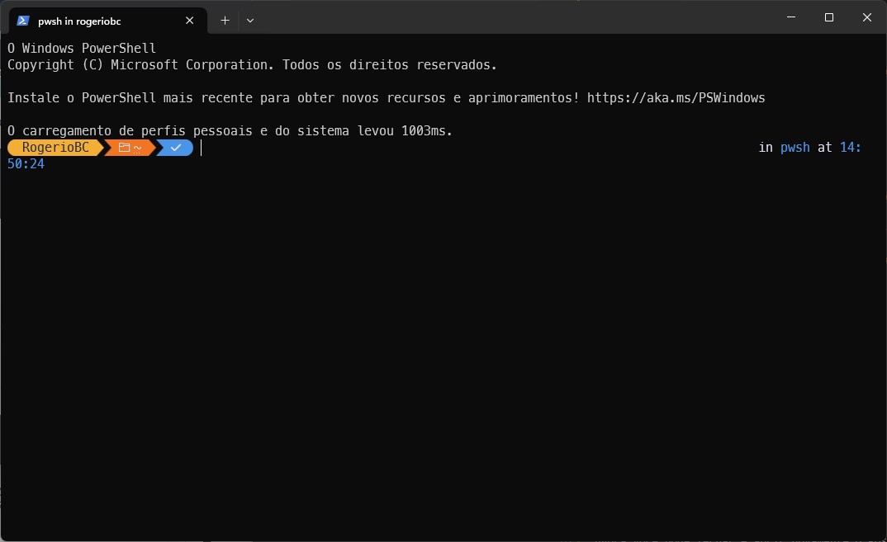
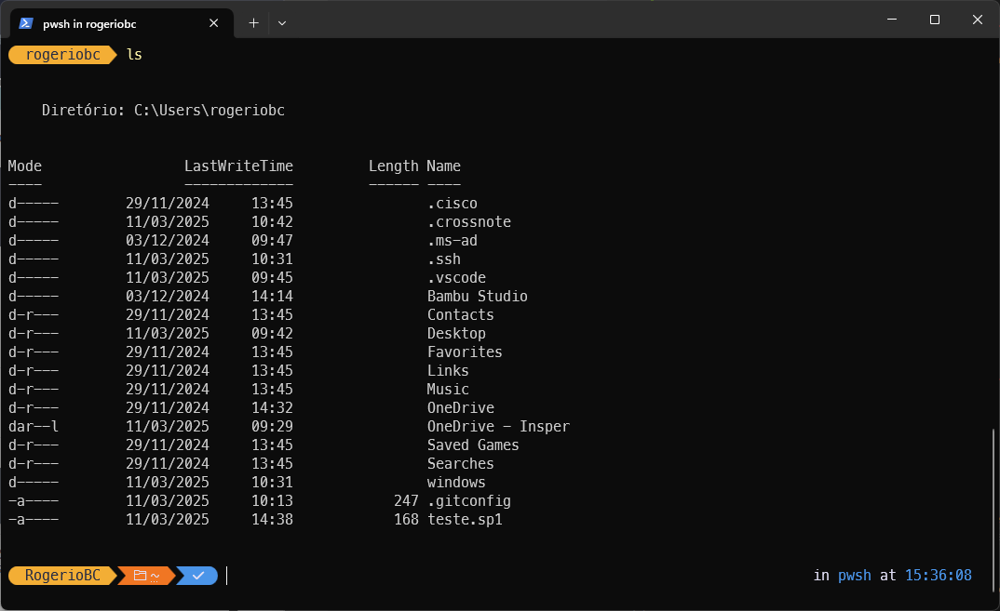
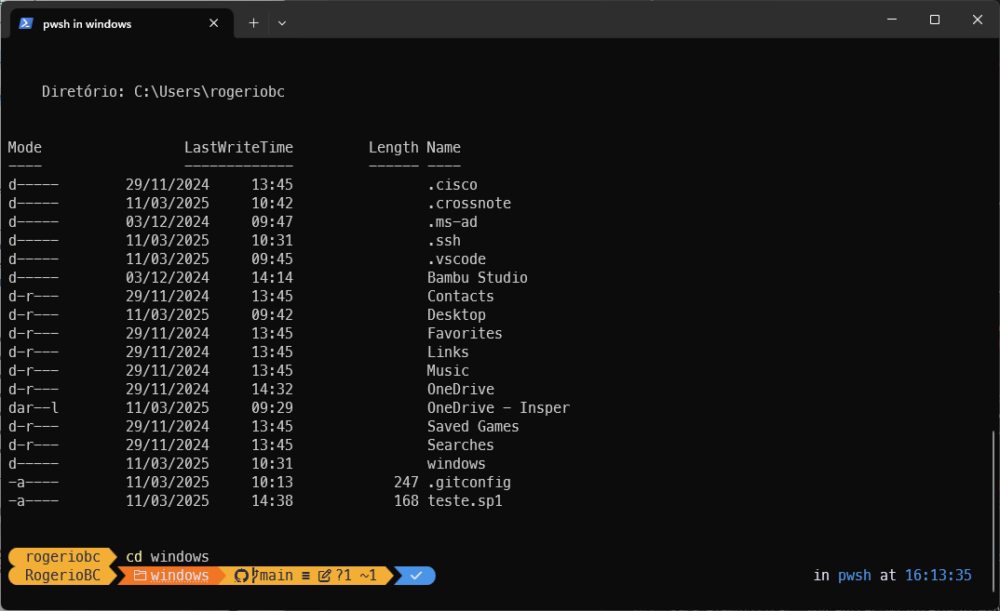

# Fundamentos do PowerShell

## Abrindo e personalizando o PowerShell - PS

O Windows PowerShell  (também chamado de PS) é muito mais do que um "prompt de comandos" como o antigo cmd herdado do DOS.

Este terminal tem muitos recusros e acessos ao sistema opercaional.

Para abror o PS, vá ao menu iniciar e pesquise por **PowerShell** ou use as teclas <kbd>Ctrl</kbd>+<kbd>R</kbd> para abrir a janela de execução e escreva **PowerShell**.

É comum utilizarmos respositórios GIT no dia a dia. Para facilitar a manipulação destes diretórios, vamos ter nosso primeiro contato com o PS instalando o Oh-My-Posh (similar ao oh-my-bash que usamos no Linux Ubuntu).

Para isso vamos usar o gerenciador de pacotes do Windows, o winget, para instalar o OhMyPowh:


``` PowerShell

winget install JanDeDobbeleer.OhMyPosh -s winget

```

Para usarmos o tema padrão do Oh-My-Posh, é preciso usar as [Nerd Fonts](https://www.nerdfonts.com/). Para instalarmos, vamos o usar a extençao de fontes do Oh-My-Posh:

``` PowerShell

oh-my-posh font install

```

Escolha a fonte **meslo**.

Se quiser instalar apenas a fonte escolhida mas sem percorrer as demais, vocë pode instalar da seguinte forma:

``` PowerShell

oh-my-posh font install meslo

```

Agora que temos a base do Oh-My-Posh, vamos fazer com que ele seja iniciado automaticamente.

* Se você já alterou o script de início do PS, ignore o primeiro comando e vá para o segundo.

Vamos então criar o script inicial do PS e na sequencia editar no próprio notepad.

``` PowerShell

New-Item -Path $PROFILE -Type File -Force

notepad $PROFILE

```

Então acrescente a seguinte linha: 

``` PowerShell

oh-my-posh init pwsh | Invoke-Expression

```

<div style="border: 1px solidrgb(19, 20, 20); border-left-width: 5px; padding: 10px; background-color:rgb(175, 178, 181); border-radius: 5px;">
💡 <strong>Dica:</strong> Você pode ter uma tela de erros devido à política de execução de scripts padrão do windows. Se isso acontecer, abra o PowerShell como administrador (clicando com o botão direito e escolhendo Executar como Admnistrador) e digite o seguinte comando no terminal: Set-ExecutionPolicy RemoteSigned
</div><br>

Agora você pode fechar e abrir novamente o PS e verá uma tela com este tema:


Agora que já temos alguma familiaridade com o PS, vamos ver alguns comandos básicos.

## Navegando entre os diretórios

Quando você abre o PS ele está no diretório raiz do seu uruário. Você pode listar o conteúdo desta pasta de arquivos com o comando **ls**. Veja o print de tela:


Vamos entender o que está nesta tela. 

* Coluna **Mode** trás informações sobre o item:
    * d: Diretório
    * l: Link (pode ser um link simbólico, atalho, etc.)
    * a: Arquivo marcado para backup (indicando que foi modificado desde o último backup)
    * r: Somente leitura
    * h: Arquivo ou diretório oculto
    * s: Arquivo ou diretório do sistema (protegido pelo sistema operacional)
* Coluna **LastWriteTime** trás informações sobre a data e hora da última modificação do item
* Coluna **Length** trás o tamanho do item, se for um arquivo
* Coluna **Name** trás o nome do item.

Para entrar em um diretório ou "subir" em um diretório você usa o comando **cd** seguido do diretório que deseja entrar. Não se esqueça de teclar <kbd>Enter</kbd> depois de cada comando!
<div style="border: 1px solidrgb(19, 20, 20); border-left-width: 5px; padding: 10px; background-color:rgb(175, 178, 181); border-radius: 5px;">
💡 <strong>Dica:</strong> a tecla <kbd>TAB</kbd> funciona como um auto-completar para o que você está digitando.
</div>

Para exemplificar, vou entrar no diretório windows (diretório do repositório desta AC)



para voltar um diretório atrás, use **cd ..**.


Pronto, agora já sabemos navegar nas pastas, editar arquivos texto usando o notepad (você pode trocar por code se estiver usando o vscode) e a listar os arquivos e pastas existentes em uma pasta que você está.

Também já utilizamos o winget para instalar os pacotes do oh-my-posh.

Vamos partir então para sintaxes do PS e uma utilização mais interessante dele.

## Sintaxe Básica
A sintaxe do PowerShell segue um padrão "Verbo-Substantivo". Por exemplo:

Get-Process: Obtém informações sobre processos em execução

Stop-Service: Para um serviço do Windows

New-Item: Cria um novo item (arquivo, pasta, etc.)

Este padrão torna os comandos mais intuitivos e fáceis de lembrar.

## Comandos Essenciais
Get-Help: Fornece informações detalhadas sobre comandos. 

Get-Command: Lista todos os comandos disponíveis

Get-Member: Mostra propriedades e métodos de objetos

Como exemplo, vamos usar o cmdlet abaixo e saber como funciona o Stop-Service:


``` 
Get-Help Stop-Service
```

Após executar este comando, você verá algo parecido com um manual do comando que passou como parâmetro.


Estes comandos são fundamentais para aprender e explorar o PowerShell.