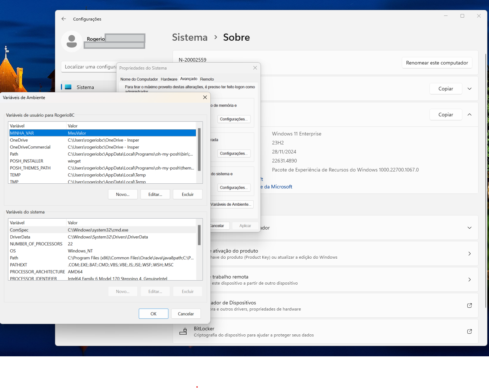
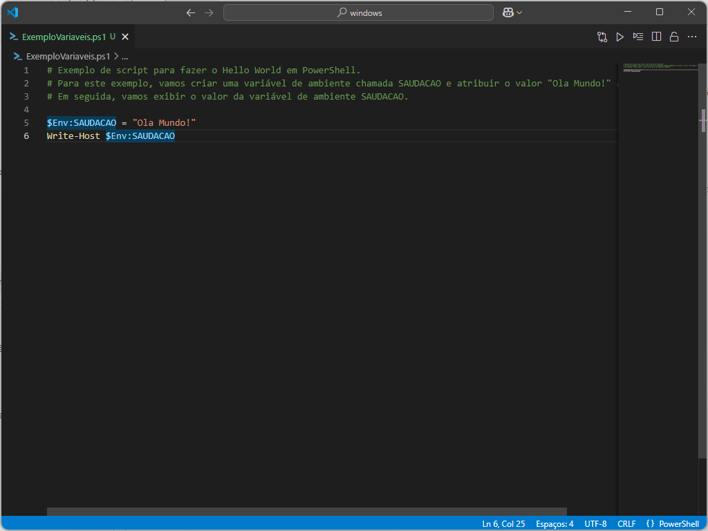

# Variáveis em PowerShell

Variáveis de ambiente são valores que afetam o comportamento de processos em um sistema operacional. Elas são usadas por aplicativos e scripts para configurar comportamentos específicos, como caminhos de sistema, configurações de aplicativos ou informações sensíveis.

## Tipos de Variáveis de Ambiente

* Variáveis de Sistema: Afetam todos os usuários do sistema e são definidas no nível do sistema operacional.
* Variáveis de Usuário: São específicas para cada usuário e são definidas no perfil do usuário.
* Variáveis de Processo: São criadas por um processo e são destruídas quando o processo termina.

## Como Visualizar e Modificar Variáveis de Ambiente

### Via GUI
Painel de Controle:

Vá para "Sistema" ou "Sistema e Segurança" > "Sistema" > "Configurações avançadas do sistema" > "Variáveis de Ambiente".


Editar Variáveis:

Para variáveis de sistema, clique em "Novo" ou "Editar" na seção "Variáveis do sistema".

Para variáveis de usuário, faça o mesmo na seção "Variáveis do usuário".

### PowerShell
Visualizar Variáveis:


``` PowerShell

Get-ChildItem Env:

``` 
<br>


<br>
Modificar Variáveis:
``` PowerShell
$Env:VARIAVEL = "valor"
``` 

Para variáveis persistentes, use:

```powershell
[System.Environment]::SetEnvironmentVariable("MINHA_VAR", "MeuValor", "User")
``` 

## Uso Prático de Variáveis de Ambiente

Variáveis de ambiente são frequentemente usadas para:

Caminhos de sistema: Definir locais de instalação de aplicativos ou bibliotecas.

Configurações de aplicativos: Armazenar informações de configuração que não devem ser hard-coded.

Segurança: Armazenar informações sensíveis, como chaves de API, de forma segura.

Elas são essenciais para manter configurações consistentes entre diferentes sessões e aplicativos no Windows.

### Exemplo

Para exemplificar o uso de variáveis, vamos fazer um pequeno script com o famoso "Hello World".

Você terá duas opções a partir deste momento, ou você clona o repositório desta atividade:

``` PowerShell
git clone https://github.com/rbcuenca/windows.git
```

Ou você cria um diretório para iniciar o primeiro script:

``` PowerShell
mkdir windows
```

<div style="border: 1px solidrgb(19, 20, 20); border-left-width: 5px; padding: 10px; background-color:rgb(175, 178, 181); border-radius: 5px;">
💡 <strong>Dica:</strong> Ao abrir o PowerShell ele te direciona para a pasta (diretório) do seu usuário, então todas as pastas e arquivos criados, ou clonados, estarão nesta pasta. Mas nada te impede de fazer em qualquer outro lugar.
Apenas fique atento e não utilize dois meios de sincronismo em nubens ao mesmo tempo. Por exemplo, clona um repositório github dentro de uma pasta do OneDrive. 
</div>

Em ambos os casos vocë terá uma pasta chamada <strong>windows</strong> dentro do seu usuário. (caso tenha escolhido outra pasta, basta trocar o nome) Então vamos "entrar" ou "subir" para esta pasta e criar o nosso script.

``` PowerShell
cd windows
code ExemploVariaveis.ps1
```

Em seguida vamos digitar o seguinte texto dentro do arquivo:

``` PowerShell
# Exemplo de script para fazer o Hello World em PowerShell. 
# Para este exemplo, vamos criar uma variável de ambiente chamada SAUDACAO e atribuir o valor "Ola Mundo!" a ela. 
# Em seguida, vamos exibir o valor da variável de ambiente SAUDACAO.

$Env:SAUDACAO = "Ola Mundo!"
Write-Host $Env:SAUDACAO
```


Neste momento você criou seu primeiro script para PowerShell utilizando variáveis de ambiente.
No primeiro comando você criou a variável de ambiente <strong>SAUDACAO</strong> e colocou o conteúdo <strong>Ola Mundo!</strong>. No segundo comando você utilizou o comando <strong>Write-Host</strong>para escrever o conteúdo da variável de ambiente <strong>SAUDACAO</sTrong>.

<div style="border: 1px solidrgb(19, 20, 20); border-left-width: 5px; padding: 10px; background-color:rgb(175, 178, 181); border-radius: 5px;">
💡 <strong>Dica:</strong> Não utilize palavas com acentuação ou outros carecteres especiais como o "<strong>ç</strong>". Vale lembrar que estas variáveis são "case sensitivity", ou seja ele reconhece de forma diferente letras <strong>minúsculas</strong> e <strong>maiúsculas</strong>. 
</div>