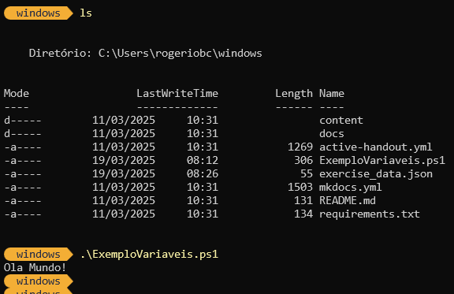
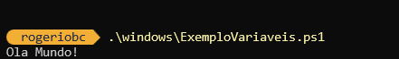

# Execução de Scripts Básicos

## Como executar um script

Este é o tópico mais simples desta atividade complementar.

Para fazer a execução o script criado no tópico antrior, vamos abrir o PS e ir até o diretório de trabalho. Em nosso exemplo, após abrir o PS vamos para a pasta windows que está dentro da pasta de usuário.

``` PowerShell
cd windows
```

Agora vamos executar o Script <strong>ExemploVariaveis.ps1</strong>

``` PowerShell
.\ExemploVariaveis.ps1
```



<div style="border: 1px solidrgb(19, 20, 20); border-left-width: 5px; padding: 10px; background-color:rgb(175, 178, 181); border-radius: 5px;">
💡 <strong>Dica:</strong> Se você começar a digitar o nome do script, começando pelas letras Ex e teclar <kbd>TAB</kbd> ele completará o restante para você! Lembre-se o <kbd>TAB<kbd> é seu melhor amigo enquanto estiver usando o temrinal. Ele tem o "poder" de auto completar quase tudo.
</div><br>

Você também pode executar o script sem estar dentro do diretório (pasta) em que o script está. Basta você entregar o caminho completo no PS.

Veja abaixo o mesmo script sendo chamado de dentro da pasta de usuário.



