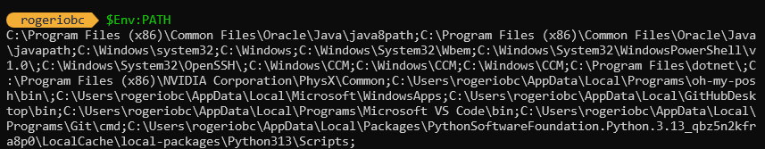

# Conceito de Variáveis de Ambiente

Variáveis de ambiente são valores que afetam o comportamento de processos em um sistema operacional. Elas são usadas por aplicativos e scripts para configurar comportamentos específicos, como caminhos de sistema, configurações de aplicativos ou informações sensíveis.

## Tipos de Variáveis de Ambiente

* Variáveis de Sistema: Afetam todos os usuários do sistema e são definidas no nível do sistema operacional.
* Variáveis de Usuário: São específicas para cada usuário e são definidas no perfil do usuário.
* Variáveis de Processo: São criadas por um processo e são destruídas quando o processo termina.

## Uso Prático de Variáveis de Ambiente

Variáveis de ambiente são frequentemente usadas para:

* Caminhos de sistema: Definir locais de instalação de aplicativos ou bibliotecas.
* Configurações de aplicativos: Armazenar informações de configuração que não devem ser hard-coded.
* Segurança: Armazenar informações sensíveis, como chaves de API, de forma segura.

Elas são essenciais para manter configurações consistentes entre diferentes sessões e aplicativos no Windows.

## Exemplo de Uso

Um exemplo comum é a variável PATH, que lista os diretórios onde o sistema procura por executáveis. Outro exemplo é a variável TEMP, que define o local onde os arquivos temporários são armazenados.

Essas variáveis são acessíveis via PowerShell usando $Env:NomeDaVariavel. Por exemplo, para visualizar o valor da variável PATH, você pode usar:

``` PowerShell
$Env:PATH
```

Isso exibe todos os diretórios incluídos na variável PATH.

