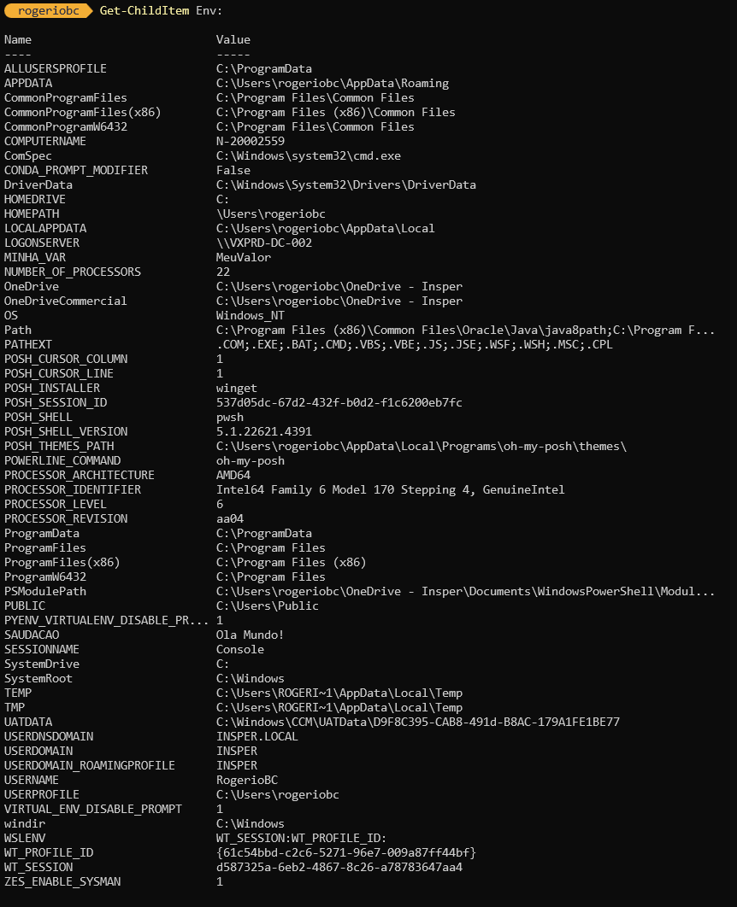

# Visualização e Modificação de Variáveis de Ambiente

## Via PowerShell

#### Visualizar Variáveis de Ambiente

Para visualizar todas as variáveis de ambiente no PowerShell, use o comando:

```powershell
Get-ChildItem Env:
```


Este comando lista todas as variáveis de ambiente atuais, incluindo seus valores.

#### Modificar Variáveis de Ambiente

Para modificar uma variável de ambiente, você pode usar a seguinte sintaxe:

```powershell
$Env:NomeDaVariavel = "NovoValor"
```

Por exemplo, para alterar a variável `TEMP`, você faria:

```powershell
$Env:TEMP = "C:\MeuDiretorioTemp"
```

Você pode veriricar a alteração da variável com o comando

``` PowerShell
Write-Host $Env:TEMP
```
Agora você pode retornar para o valor `padrão` do sistema com o seguinte comando

``` PowerShell
$Env:TEMP = [System.Environment]::GetEnvironmentVariable("TEMP", "Machine")
```

Confira se a variável voltou ao padrão que estava antes da alteração.

** No entanto, essa alteração é temporária e só permanece até o fim da sessão atual do PowerShell.

#### Criar Variáveis de Ambiente Persistentes

Para criar uma variável de ambiente persistente, use o método `[Environment]::SetEnvironmentVariable`:

```powershell
[Environment]::SetEnvironmentVariable("NomeDaVariavel", "Valor", "User")
```
<div style="border: 1px solidrgb(19, 20, 20); border-left-width: 5px; padding: 10px; background-color:rgb(175, 178, 181); border-radius: 5px;">
💡 <strong>Dica:</strong> Note que o último parâmetro do comando é <strong>User</strong> ou seja, afeta apenas o usuário em uso.
</div><br>

Para o escopo "Machine", que afeta todos os usuários:

```powershell
[Environment]::SetEnvironmentVariable("NomeDaVariavel", "Valor", "Machine")
```

<div style="border: 1px solidrgb(19, 20, 20); border-left-width: 5px; padding: 10px; background-color:rgb(175, 178, 181); border-radius: 5px;">
💡 <strong>Dica:</strong> Agora que o último parâmetro do comando é <strong>Machine</strong> todos os usuários serão afetados.
</div><br>

## Via GUI

#### Acessar Variáveis de Ambiente no Painel de Controle

1. **Abrir o Painel de Controle**:
    - Pressione <kbd>`Win`</kbd>+<kbd>`R`</kbd>, digite `control` e pressione Enter.
2. **Ir para Sistema**:
    - Selecione "Sistema" ou "Sistema e Segurança" > "Sistema".
3. **Configurações Avançadas**:
    - Clique em "Configurações avançadas do sistema" na lateral direita.
4. **Variáveis de Ambiente**:
    - Na guia "Avançado", clique em "Variáveis de Ambiente".
5. **Editar ou Adicionar Variáveis**:
    - Na janela "Variáveis de Ambiente", você pode adicionar, editar ou remover variáveis tanto para o usuário atual quanto para o sistema.

#### Adicionar uma Variável de Ambiente

1. **Clique em "Novo"**:
    - Na seção "Variáveis do usuário" ou "Variáveis do sistema", clique em "Novo".
    - Insira o nome e valor da variável.
2. **Salvar Alterações**:
    - Clique em "OK" para salvar a nova variável.

### Exemplo Prático

Suponha que você queira criar uma variável de ambiente chamada `MEU_CAMINHO` que aponte para um diretório específico.

**Via PowerShell**:

```powershell
$Env:MEU_CAMINHO = "C:\MeuDiretorio"
```

Para torná-la persistente:

```powershell
[Environment]::SetEnvironmentVariable("MEU_CAMINHO", "C:\MeuDiretorio", "User")
```

**Via GUI**:

- Repita os cinco passos anteriores para chegar nas Variáveis de Ambiente, partindo do painel de controle.
- Na seção "Variáveis do usuário", clique em "Novo".
- Insira `MEU_CAMINHO` como nome e `C:\MeuDiretorio` como valor.

Essas são as principais formas de visualizar e modificar variáveis de ambiente no Windows usando PowerShell e a interface gráfica do usuário.
