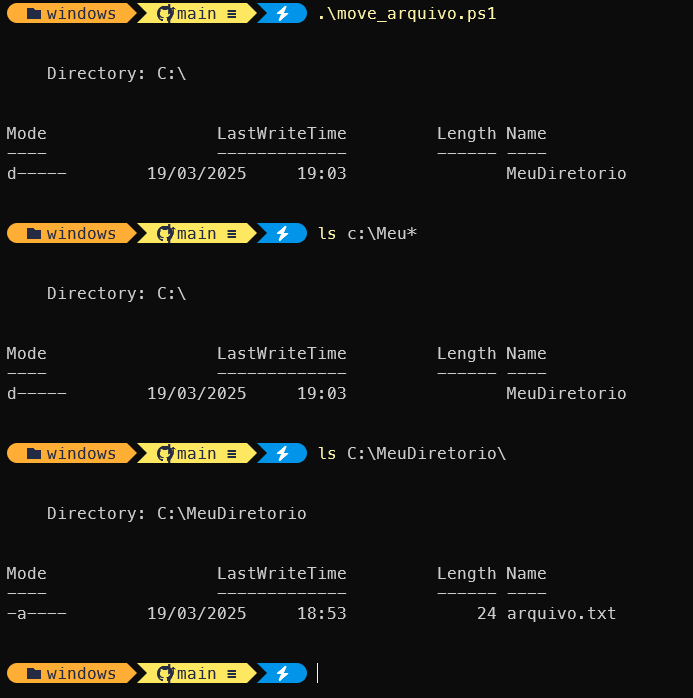

# Criação de Scripts para Automação de Tarefas

## Introdução

Scripts PowerShell são arquivos de texto que contêm uma série de comandos que são executados sequencialmente. Eles são fundamentais para automatizar tarefas repetitivas e simplificar a administração de sistemas.

## Estrutura Básica de um Script

Um script PowerShell básico consiste em:

1. **Comandos PowerShell**: Cada linha do script pode conter um comando PowerShell.
2. **Variáveis**: Usadas para armazenar valores que podem ser usados em diferentes partes do script.
3. **Estruturas de Controle**: Loops e condicionais permitem que o script tome decisões e execute ações repetidas.

## Criando um Script

1. **Abrir um Editor de Texto**:
    - Como colocado no início da atividade, vamos usar o VSCode.
2. **Escrever o Script**:
    - Digite os comandos PowerShell que você deseja executar.
3. **Salvar o Arquivo**:
    - Salve o arquivo com a extensão `.ps1`.

## Exemplo de Script Simples

Suponha que você queira criar um script que crie um diretório chamado "MeuDiretorio" no disco C e, em seguida, copie um arquivo chamado "arquivo.txt" para esse diretório.

Para facilitar, vamos manter o arquivo de origem dentro do diretório corrente desta atividade. Se você clonou, previamente, este repositório, o arquivo já existe.

Vá até o diretório em que clonou a atividade, ou o diretório que você criou no primeiro script, através so PS.

Crie um arquivo chamado move_arquivo.ps1 com o comando: `code move_arquivo.ps1` e coloque o conteúdo a seguir. Não se esqueça de salvar!

```powershell
# Criar um novo diretório
New-Item -ItemType Directory -Path "C:\MeuDiretorio"

# Copiar um arquivo para o diretório criado
Copy-Item "arquivo.txt" -Destination "C:\MeuDiretorio"
```

Se você clonou o repositório o arquivo.txt já existe, se você criou a pasta, crie um arquivo chamado arquivo.txt e coloque algum texto dentro dele. Mantenha o arquivo no mesmo diretório.


## Executando o Script

1. **Abrir o PowerShell**:
    - Pressione <kbd>`Win`</kbd> + <kbd>`R`</kbd>, digite `powershell` e pressione Enter.
2. **Navegar até o Diretório do Script**:
    - Use o comando `cd` para ir até o diretório onde o script está salvo.
3. **Executar o Script**:
    - Use o comando `.\nomeDoScript.ps1` para executar o script.

Exemplo:

```powershell
.\meuScript.ps1
```


### Dicas para Criar Scripts Eficientes

- **Testar Comandos**: Antes de criar um script, teste cada comando individualmente no PowerShell para garantir que ele funcione corretamente.
- **Usar Variáveis**: Variáveis podem ajudar a tornar o script mais flexível e reutilizável.
- **Tratar Erros**: Use try-catch para lidar com erros e manter o script estável.

Essas são as bases para criar scripts simples em PowerShell. Com prática, você pode automatizar tarefas complexas e melhorar a eficiência na administração de sistemas.

