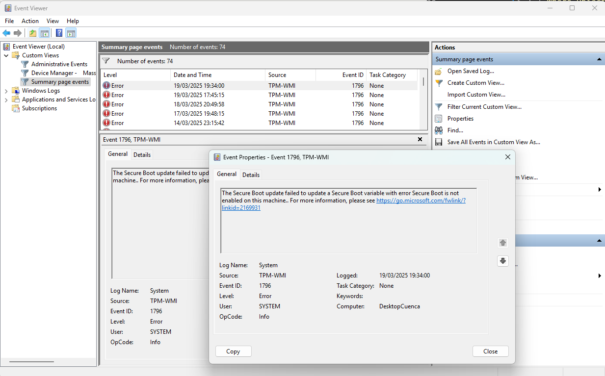

# Uso do Visualizador de Eventos para Diagnóstico Simples

* Introdução

O Visualizador de Eventos é uma ferramenta poderosa no Windows que permite aos usuários monitorar e solucionar problemas do sistema operacional. Ele registra eventos significativos, incluindo erros de software, falhas de hardware e avisos de segurança, ajudando a identificar e resolver problemas potenciais.

## Como Acessar o Visualizador de Eventos

1. **No Windows 11 e 10**:
    - Pressione `Win + X` e selecione "Visualizador de Eventos".
    - Ou pressione `Win + R`, digite `eventvwr` e pressione Enter.
2. **No Windows 7**:
    - Vá para o Painel de Controle > Sistema e Segurança > Ferramentas Administrativas > Visualizador de Eventos.

## Navegando no Visualizador de Eventos

1. **Logs do Windows**:
    - Clique em "Logs do Windows" no painel esquerdo.
    - Selecione "Sistema" para eventos relacionados ao sistema operacional.
    - Selecione "Segurança" para eventos de segurança.
2. **Logs de Aplicativos e Serviços**:
    - Contém logs de aplicativos e serviços específicos.

## Identificando Eventos Importantes

1. **Nível de Evento**:
    - **Crítico**: Problemas graves que podem afetar o sistema.
    - **Erro**: Problemas que podem causar falhas.
    - **Aviso**: Situações que podem se tornar problemas.
    - **Informativo**: Eventos normais que não indicam problemas.
2. **ID do Evento**:
    - Cada evento tem um ID único que pode ser usado para pesquisar soluções específicas.

## Visualizando Detalhes de um Evento

1. **Selecione um Evento**:
    - Clique duas vezes em um evento no painel central.
    - A janela "Propriedades do Evento" mostrará detalhes sobre o problema.

## Filtrando Eventos

1. **Filtrar Log Atual**:
    - Clique com o botão direito em uma categoria de log e escolha "Filtrar Log Atual".
    - Especifique critérios como nível de evento ou ID de evento.

## Exemplo Prático

Um erro que temos nas máquinas com `Dual Boot` é sobre o `Secure Boot` estar desligado. Veja no print abaixo.



* Uso no PowerShell

Para acessar eventos do Visualizador de Eventos via PowerShell, use o cmdlet `Get-WinEvent`:

```powershell
Get-WinEvent -LogName System
```

Isso lista eventos do log do sistema. Você pode filtrar eventos por nível ou ID usando parâmetros adicionais.

## Exemplo Prático

Suponha que você queira encontrar o evento de erro causado pela falta do Secure Boot habilitado. Veja como é o script.

<div style="border: 1px solidrgb(19, 20, 20); border-left-width: 5px; padding: 10px; background-color:rgb(175, 178, 181); border-radius: 5px;">
💡 <strong>Dica:</strong> Crie um script de nome erro_tpm.ps1 com o conteúdo a seguir e veja o resultado.</div><br>

```powershell
$xml = @'
<QueryList>
    <Query Id="0" Path="System">
        <Select Path="System">*[System/Provider[@Name='Microsoft-Windows-TPM-WMI'] and System/Level=2]</Select>
    </Query>
</QueryList>
'@

$startDate = (Get-Date).AddDays(-14)

$events = Get-WinEvent -FilterXml $xml -ErrorAction SilentlyContinue | Where-Object {$_.TimeCreated -ge $startDate}

if ($events) {
    $lastError = $events | Sort-Object TimeCreated -Descending | Select-Object -First 1
    Write-Host "Ultimo erro encontrado:"
    Write-Host "Dia e Hora: $($lastError.TimeCreated)"
    Write-Host "Mensagem: $($lastError.Message)"
} else {
    Write-Host "Nenhum erro encontrado com fonte 'Microsoft-Windows-TPM-WMI' nas ultimas duas semanas."
}
```

### Explicação Passo a Passo

#### **Definir o Filtro XML**:

```powershell
$xml = @'
<QueryList>
    <Query Id="0" Path="System">
        <Select Path="System">*[System/Provider[@Name='Microsoft-Windows-TPM-WMI'] and System/Level=2]</Select>
    </Query>
</QueryList>
'@
```

    - Este bloco define um filtro XML para buscar eventos.
    - **QueryList**: Contém uma lista de consultas.
    - **Query**: Define uma consulta específica.
        - **Id="0"**: Identificador da consulta.
        - **Path="System"**: Especifica que os eventos devem ser buscados no log do sistema.
    - **Select**: Especifica quais eventos devem ser selecionados.
        - **Provider[@Name='Microsoft-Windows-TPM-WMI']**: Filtra eventos do provedor "Microsoft-Windows-TPM-WMI".
        - **System/Level=2**: Filtra apenas eventos de erro (nível 2).
#### **Definir a Data Inicial**:

```powershell
$startDate = (Get-Date).AddDays(-14)
```

    - Esta linha define a data inicial para a busca de eventos. Ela é calculada como a data atual menos 14 dias.
#### **Buscar Eventos com Filtro XML**:

```powershell
$events = Get-WinEvent -FilterXml $xml -ErrorAction SilentlyContinue | Where-Object {$_.TimeCreated -ge $startDate}
```

    - **Get-WinEvent**: Este cmdlet é usado para obter eventos do log do sistema usando o filtro XML definido.
    - **-FilterXml \$xml**: Aplica o filtro XML para buscar eventos do provedor "Microsoft-Windows-TPM-WMI" e nível de erro.
    - **-ErrorAction SilentlyContinue**: Ignora erros que possam ocorrer durante a execução do comando.
    - **Where-Object {\$_.TimeCreated -ge \$startDate}**: Filtra os eventos para incluir apenas aqueles que ocorreram após a data inicial.
#### **Verificar se Eventos Foram Encontrados**:

```powershell
if ($events) {
    # ...
} else {
    # ...
}
```

    - Se a variável `$events` não estiver vazia, significa que eventos foram encontrados.
#### **Encontrar o Último Erro**:

```powershell
$lastError = $events | Sort-Object TimeCreated -Descending | Select-Object -First 1
```

    - **Sort-Object TimeCreated -Descending**: Ordena os eventos em ordem decrescente por data e hora de criação.
    - **Select-Object -First 1**: Selecione o primeiro evento da lista ordenada, que será o último erro ocorrido.
#### **Exibir Informações do Último Erro**:

```powershell
Write-Host "Último erro encontrado:"
Write-Host "Dia e Hora: $($lastError.TimeCreated)"
Write-Host "Mensagem: $($lastError.Message)"
```

    - Exibe informações sobre o último erro encontrado, incluindo a data e hora de ocorrência e a mensagem do erro.
#### **Mensagem Caso Nenhum Erro Seja Encontrado**:

```powershell
Write-Host "Nenhum erro encontrado com fonte 'Microsoft-Windows-TPM-WMI' nas últimas duas semanas."
```

    - Se a variável `$events` estiver vazia, exibe uma mensagem indicando que nenhum erro do provedor "Microsoft-Windows-TPM-WMI" foi encontrado.

## Dicas para Usar o Visualizador de Eventos

- **Monitorar Regularmente**: Verifique regularmente os logs para detectar problemas potenciais antes que eles se tornem graves.
- **Pesquisar IDs de Evento**: Use a ID do evento para pesquisar soluções específicas na internet.
- **Criar Visualizações Personalizadas**: Para facilitar a verificação de eventos específicos, crie visualizações personalizadas.

Essas são as principais formas de usar o Visualizador de Eventos para diagnóstico simples no Windows. Com essas informações, você pode identificar e resolver problemas de forma mais eficiente.
